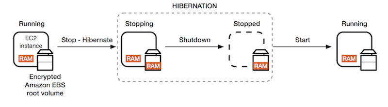

### Associate EC2

#### Amazon EC2 
+ It is most popular of AWS offering
+ It consist in the capability of
    + renting VM (EC2)
    + storing data on virtual drives (EBS)
    + distributing load across machines (ELB)
    + scaling the services using an auto-scaling, group (ASG)
+ knowing EC2 is fundamental to understand how cloud work.    
+ It provide virtual machine reffered to as EC2 instance in the cloud
+ Give you full control over the guest OS on each instace
+ We can launch instance of any size into an Aavailability Zone anywhere in the world
+ launch instance from AMI
+ we can control traffic to and from instance 
+ uses are application server, web server

#### EC2 User Data
+ It is possible to launch our commands when machine start using ec2 user data script
+ Ec2 user data is used to automate book tasks such as:
 + installine updates
 + installing software
 + downloading common files from the internal
+ EC2 user data script runs with root user 

#### Ec2 instance types
1. General purpose
+ All the types that start with family 't' like t2.micro, t3.micro etc
+ it make balance between compute, memory and networking

2. Compute optimized
+ All types starting with family 'c' like C5.large
+ it is great for computing intensive task that require high performance processors.

3. Memory optimized
+ Series of R like r5.large
+ fast performance for workload, high performance, perform real time processing og big unstructured data.

4. Storage optimized
+ family start with 'D' ,'H' and 'I' like i3.large
+ used for storing intensive task
+ high frequency OLTP system

#### Introduction to Security Group
+ security group is something that is embedded in any instance which act as firewall for that instance
+ all the inbound to the instance and outbound fro the instance are filtered in security group 
+ if the unauthorized port send some information the access is denied
+ authorized IP ranges IPV4 and IPV6
+ if your application is not accessible (time out)then its a issue of security group
+ if your application gives a "connection refused", error when its an applicaion error or its not launched.

#### Classic port to know
+ 22 = SSH(secure shell) to log into a linux instance
+ 21= FTP (file transfer protocol) upload files into a fule sahre
+ 22 = SFTP( secure ftp) upload file using ssh
+ 80 = HTTP- access unsecured websites
+ 443= HTTPS access secured websites
+ 3389 = RDP (Remote Desktop Protocol) log into a window instance

### SSH Summary Table
<!DOCTYPE html>
<html lang="en">

<body>

<table>
  <tr>
    <th></th>
    <th>SSH</th>
    <th>Putty</th>
    <th>EC2 instance connect</th>
  </tr>

  
  <tr>
    <th>Mac</th>
    <td>&#10004;</td>
    <td></td>
    <td>&#10004;</td>
    
  </tr>
  <tr>
    <th>Linux</th>
    <td>&#10004;</td>
    <td></td>
    <td>&#10004;</td>
  </tr>
  <tr>
    <th>Window<10</th>
    <td></td>
    <td>&#10004;</td>
    <td>&#10004;</td>
  </tr>
  <tr>
    <th>Window>=10</th>
    <td>&#10004;</td>
    <td>&#10004;</td>
    <td>&#10004;</td>
  </tr>
</table>

</body>
</html>

### EC2 instance Roles Demo
+ my first instance->connect
+ ec2 instance connect-> connect
+ linux terminal is opened in browser
+ write : aws --version
+ aws iam list-users
+ aws configure
 + It ask for AWS access key id, name, region and output format
 + But it is not good way becaus eit can leak detail if anyone connect to our EC2 instance

#### EC2 purchasing options
1. On demand instance
+ we have to pay for what we use
+ we can pay per second after first minute for windows or linux and hourly for other OS
+ recommended for short term and uninterrupted workload 

2. Reserved Instances
+ It provides upto 72% discount compared to on demand.
+ Reservation period is 1 to 3years
+ payment options- no upfront(+), partial (++), full upfront(+++)
+ convertible reserved instance can change instance type,family, os etc.

3. Ec2 saving plans
+ discount is similar of Reserved instance
+ commit to a certain type of usage( $10|hour for 1 or 3 years)
+ flexible across m5.xlarge, m5.2xlarge etc

4. EC2 spot instances
+ can get discount upto 90% compared to on demand
+ Instances that you can lose at any point of time if your max price is less than the current spot price

5. Ec2 Dedicated Host
+ instance run on hardware that's dedicated to us
+ may share hardware with other instances in the same account
+ no control over instance placement

6. EC2 capacity reservation
+ it is reserved on demand instances capacity in a specific AZ for any duration
+ we always have access to ec2 capacity when you need it
+ charge at on demand rate whether we run instance or not

#### EC2 spot instances requests
The process of requesting and using EC2 Spot Instances in AWS involves several steps:

1. Creating a Spot Instance Request:
   To request Spot Instances, you use the AWS Management Console, AWS CLI, or an SDK to create a Spot Instance request. In this request, you specify parameters such as instance type, maximum price (bid price), availability zone, and the number of instances you need.

2. Spot Instance Pricing:
    AWS calculates Spot prices based on supply and demand for EC2 capacity. Your bid price should be equal to or greater than the current Spot price to ensure your Spot Instances are fulfilled. If the Spot price exceeds your bid price, your instances may be terminated with a two-minute notification.

3. Fulfillment: 
   When your bid price exceeds the current Spot price, AWS fulfills your Spot Instance request by launching the requested instances. The instances run until the Spot price exceeds your bid price or capacity becomes unavailable, at which point they may be terminated with a two-minute notification.

4. Handling Interruptions:
   Since Spot Instances can be interrupted with short notice, it's essential to design your applications to handle interruptions gracefully. You can use strategies like checkpointing, auto-scaling groups, and maintaining state externally to handle interruptions and ensure application availability.

5. Termination Notifications:
   AWS provides a two-minute notification before terminating Spot Instances due to changes in Spot prices or capacity availability. This notification allows your applications to gracefully handle the instance termination by saving state, completing tasks, or transferring workloads to other instances.

6. Monitoring and Managing Spot Instances: 
   You can monitor and manage your Spot Instances using AWS services like Amazon CloudWatch, AWS Trusted Advisor, and AWS Cost Explorer. These services provide insights into instance performance, cost optimization, and recommendations for improving efficiency.

7. Spot Fleet: 
   Alternatively, you can use Spot Fleet to manage a combination of Spot Instances, On-Demand Instances, and Reserved Instances to meet your workload requirements efficiently. Spot Fleet automatically fulfills your capacity requirements while optimizing costs based on your preferences and constraints.

By following these steps and best practices, you can effectively request, manage, and utilize EC2 Spot Instances in AWS to reduce costs and scale your applications dynamically.

#### How to terminate spot instances
There are two types of request
1. One-Time Request: 
   This type of request is for a single, short-term allocation of Spot Instances. With a one-time request, you specify the instance type, the maximum price (bid price) you're willing to pay per hour, the number of instances you need, and other parameters such as the availability zone. AWS attempts to fulfill this request by launching the requested number of Spot Instances that match your specifications. These instances run until they are interrupted due to either the Spot price exceeding your bid price or capacity constraints in the AWS cloud. Once the instances are terminated, the one-time request is considered fulfilled, and you may need to create a new request if you require additional instances.

2. Persistent Request (Spot Fleet): 
   This type of request involves using Spot Fleet, which allows you to maintain a specified number of Spot Instances continuously over time. With a persistent request, you configure Spot Fleet with parameters such as the instance types, the maximum price, the target capacity, and optional parameters like diversification across multiple Spot pools and instance weighting. Spot Fleet continually monitors and maintains the target capacity you specify, replenishing any terminated instances automatically to meet your capacity requirements. This type of request is suitable for long-running or continuous workloads where you need to maintain a certain capacity of instances over time.

#### Strategies to allocate spot instances   
+ lowest price : from the pool with lowest price
+ diversified: distributed across all pools
+ capacity optimized: pool with the optimal capacity for the number of instance
+ price capacity optimized: pods with highest capacity available then select the pod with lowest price
+ spot fleets allows us to automatically request spot instances with lowest price

#### Private vs public IP (IPV4)
1. Public IP
   + It means the machine can be identified on the internet
   + Must be unique across the whole web
   + can be geo-located easily

2. Private IP
   + It means the machine can only be identified on a private network only
   + The IP must be unique across the private network
   + But 2 different private networks can have the same IPs
   + machine connect www using an internet gateway (a proxy)
   + only a specified range of IPs can be user as private IP   

3. Elastic IPs
+ when you stop and then start an EC2 instance, it can change its public IP
+ if you need to have a fixed public IP for your instance you need an elastic IP
+ It is a public IPV4 you own as long as you don't delete it
+ you can attach it to one instance at a time
+ with it, you can mask the failure of an instance or software by rapidly remapping the address to another instance in your account
+ we can have only 5 elastic ip address   
+ overall try to avoid using elastic ip
  + They often reflect poor architectural decision
  + instead, user a random public ip and register a DNS name to it
  + Or as we'll see later, use a Load Balancer and don't use public ip

#### Lab
1. if we copy public ip address and put it in CLI as:
 + 'ssh -i EC2tutorial.pem ec2-user@2.123.222.21' then it shows some results
 + if we copy private ip it does not shows any
 + likewise if we stop instance and start again we will get new ip address
 + in this case use elastic ip
 + to use that click elastic ip from left side 'network and security'
 + open in new tab and allocate new elastic ip address from amazon pool of Ip address
 + click 'allocate'
 + we get a elastic ip address there
 + of these ip address is not in use terminate them to reduce cost
 + clock action and choose associate ip address
 + Resource type: instance
 + instance : choose that is running
 + private up address
 + click associate
 + finally our public ip address is not changed
 + to remove disassociate ip address and then release it

 #### Placement group
 + When we want to have a control of how ec2 instance going to be placed so we use placement group
 + we can do it in 3 ways are:
  1. Cluster
     + since many ec2 instances are in same rack( hardware) it decreases latency and perform high speed 10Gbps bandwith between instances
     + if the rack fails all instances fail at the same time

   2. Spread
      + In this method different availability zones are used in each availability zone we can keep only 7 partition.
      + for example lets take 3 A.Z each with 2 hardware and in each hardware there is 1 ec2 instance  
      + it reduce risk because if on1 hardware fail another can be used
    
   3. Partition 
      + we can have 7 partition in 1 A.Z and can have many ec2 instance in each partition
      + example we take 2 A.Z and in first A.Z we take 2 partition and each partition consists of 4 ec2 instance and in second A.Z 1 partition with 4 ec2
      + we can get 100s of instances within a setup
      + each partition is isolated from failure
      + ec2 instances get access to the partition information as metadata
      + Use cases: HDFS,HBase

#### Lab  
+ Find 'Placement group' in the network and security
+ click on 'create placement group'
+ Name: first-group
+ placement strategy: cluster
+ click create group
+ Again create placement group but this time strategy shoul be different like spread
+ spread level: Rack(no restriction)
+ click create group
+ next time strategy: partition
+ no of partition: 3
+ create group
+ Click Instance and launch instance
+ Advance detail-> Placement group name: choose any one group that we made before like 'first-group'

#### Elastic Network Interfaces(ENI)
+ ENI is a logical component in a VPC that represent a virtual card
+ They are what gives ec2 instances access to the network abd acn be used outside the ec2 instances as well
+ example we have 1 A.Z and 1 ec2 instance and to it is attached on eth0, your primary ENI which provide your EC2 instance network connectivity and Private IP
+ we cana lso have secondary ENI with eth1
+ It can have primary private ipv4, one or more secondary ipv4
+ 1 elastic ipv4 per private ipv4
+ 1 or more security group
+ A MAC address
+ we can create EMI independently and attach them on ec2 instances
+ We can also make second ec2 instance and move eth1- secondary ENI of previous ec2 instance to this ec2 instance
+ as we can create an instance and attach storage to it likewise we can attach ENI

### Lab
+ Lets create 2 instances
+ When scroll down to network interface we can se 'Interface ID, pubic , private IPV4, ....etc
+ we can also create a new network interface
+ In the left hand side there is 'Nework interface' click on that and create new network interface
+ Description: DemoENI
+ Subnet: ....
+ Private IPV4 address: auto assign
+ Security group: sg-....
+ click 'create network interface'
+ Click on 'DemoENI'
+ Click 'action' -> attach
+ Instance: choose any and 'attach'
+ Refresh
+ click Networking
+ scrolling down there is 'network interfaces(2) one of them is primary which gives us a public and private IPV4 and demoENi gives us a secondary private ipv4
+ This DemoENi we have control over so we could take it and move from one instance to another imaging that the two ec2 instances are running the same application and we want to access them using the private ipv4. Then we can move the ENI over the reason is to do a very quick and easy network failover between the instance by moving the ENI
+ For this we can detach and reattach again

### EC2 Hibernate
+ As we know the concept of start,stop and terminate like hibernate is another
+ it is much faster because it is just freezed the OS is not stopped or restarted.
+ USe cases: long running processing, saving the RAM, services that take time to initialize
+ Lets take ec2 instance that is running and the data is in RAM then we start the hibernation process  
+ Then the instance will go in the stopping state and the RAM is goint to be dumped into your EBS volume
+ The the instance is hut down and the RAM disappears because as soon as you stop an instance the RAM goes away, but the EBS volume still contains the dump of the RAM
+ And then when the instance is started, then the RAM is going to be loaded onto the EC2 instance memory And that means that it is just as is your ec2 instance never got stopped

