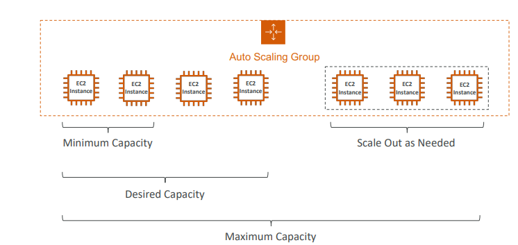

#### Scalability & High Availability
+ Scalability means that an application / system can handle greater loads 
by adapting. 
+ There are two kinds of scalability:
+ Vertical Scalability
+ Horizontal Scalability (= elasticity)
+ Scalability is linked but different to High Availability
+ Scalability refers to a system's ability to handle increasing loads by adding resources or scaling out horizontally across multiple nodes.

+ High availability, on the other hand, is concerned with ensuring that a system remains operational and accessible for a high percentage of time, typically measured as uptime.

1. Vertical Scalability:

+ Involves increasing the size or capacity of a single instance or server.
+ Commonly used for non-distributed systems such as databases.
+ Example: Upgrading from a small instance like t2.micro to a larger instance like t2.large.
+ Services like RDS (Relational Database Service) and ElastiCache support vertical scalability.
+ There is typically a limit to how much you can vertically scale due to hardware constraints.

2. Horizontal Scalability:

+ Involves increasing the number of instances or systems for an application.
+ Commonly used for distributed systems, such as web applications.
+ Easily achieved with cloud offerings like Amazon EC2, where you can spin up multiple instances as needed.
+ Horizontal scalability allows the workload to be distributed across multiple machines, increasing overall capacity and redundancy.

#### High Availability (HA) and Horizontal Scaling:

+ High Availability (HA):

    + Often coupled with horizontal scaling.
    + Involves running the system in at least 2 data centers (Availability Zones).
    + Goal: Survive a data center loss to maintain operational continuity.

+ Passive HA:
    + Example: RDS Multi-AZ.
    + Standby resources are activated during failures.

+ Active HA with Horizontal Scaling:
    + Distributes workload across multiple active instances.
    + Load balancers manage traffic distribution for scalability and redundancy.

#### Types of Scaling
+ Vertical Scaling:
    + Increasing the size of a single EC2 instance by upgrading its specifications.
    + Example: Upgrading from a small instance like t2.nano to a large one like u-12tb1.metal, which offers significantly more resources.

+ Horizontal Scaling:
    + Increasing the number of EC2 instances to handle increased load or traffic.
    + Achieved using Auto Scaling Groups, which automatically adjust the number of instances based on predefined conditions.

+ Load Balancer:
    + Distributes incoming traffic across multiple EC2 instances to ensure optimal resource utilization and availability.
    + Helps in horizontal scaling by evenly distributing workload among instances.

+ High Availability:
    + Ensures continuous operation and minimizes downtime by deploying EC2 instances across multiple Availability Zones (AZs).
    + Auto Scaling Groups can be configured to launch instances in multiple AZs for redundancy and fault tolerance.
    + Load Balancers can also be set up to route traffic to instances in different AZs for improved availability and reliability.

#### Load Balancing
+ Load Balances are servers that forward traffic to multiple 
servers (e.g., EC2 instances) downstream

#### Why use a load balancer?

+ Spread load across multiple downstream instances: Balances incoming traffic across multiple servers, preventing any single server from being overwhelmed.

+ Expose a single point of access (DNS) to your application: Simplifies access for users by providing a single entry point to the application.

+ Seamlessly handle failures of downstream instances: Detects and redirects traffic away from failed or unhealthy servers, ensuring continuous service availability.

+ Do regular health checks to your instances: Monitors the health of downstream servers and removes unhealthy instances from the pool of available servers.

+ Provide SSL termination (HTTPS) for your websites: Terminates SSL connections at the load balancer, reducing the processing load on backend servers and simplifying SSL certificate management.

+ Enforce stickiness with cookies: Maintains session persistence by directing subsequent requests from a client to the same backend server, which can be useful for stateful applications.

+ High availability across zones: Distributes traffic across multiple data centers or availability zones to improve reliability and fault tolerance.

+ Separate public traffic from private traffic: Acts as a gateway, separating incoming public traffic from internal/private traffic, enhancing security and network segmentation.

#### Why use Elastic Load Balancing?
+ Managed Load Balancer: ELB is a managed service provided by AWS, meaning AWS handles the setup, maintenance, and upgrades of the load balancer infrastructure.

+ Guaranteed Working: AWS guarantees the reliability and availability of ELB, ensuring that it remains operational and performs as expected.

+ Maintenance and High Availability: AWS manages the high availability of ELB, ensuring that it is fault-tolerant and available even during upgrades or maintenance activities.

+ Limited Configuration Knobs: ELB abstracts away much of the complexity of load balancer configuration, offering a simplified interface with only a few configuration options, making it easier to use.

+ Cost-Efficient: While setting up your own load balancer might cost less initially, using ELB saves significant effort as AWS handles the operational overhead, resulting in potential long-term cost savings.

+ Integration with AWS Services: ELB seamlessly integrates with various AWS offerings and services such as EC2, EC2 Auto Scaling Groups, Amazon ECS, AWS Certificate Manager (ACM), CloudWatch, Route 53, AWS WAF (Web Application Firewall), and AWS Global Accelerator, simplifying the setup and management of complex architectures.

#### Health Checks
+  Health Checks are crucial for Load Balancers
+ They enable the load balancer to know if instances it forwards traffic to 
are available to reply to requests
+ The health check is done on a port and a route (/health is common)
+ If the response is not 200 (OK), then the instance is unhealthy

#### Types of Load Balancer
1. Classic Load Balancer (CLB) (vI-old generation)-2009:
+ External (Public) CLB: Routes incoming traffic from the internet to the instances in your VPC. It has a public DNS name and public IP addresses.

+ Internal (Private) CLB: Routes traffic between the instances within the same VPC. It does not have a public DNS name or public IP addresses and is accessible only within the VPC.

2. Application Load Balancer (ALB)  (v2 - new generation) – 2016:
+ External (Public) ALB: Distributes incoming web traffic across multiple targets in multiple availability zones. It has a public DNS name and public IP addresses.

+ Internal (Private) ALB: Distributes traffic to targets within the same VPC, making it ideal for internal services. It does not have a public DNS name or public IP addresses.

+ Layer 7 (HTTP) Load Balancing: ALBs operate at the application layer (Layer 7) of the OSI model, enabling them to intelligently distribute incoming HTTP and HTTPS traffic to backend targets.

+ Load Balancing to Multiple HTTP Applications Across Machines (Target Groups): ALBs support routing traffic to multiple target groups, allowing you to direct requests to different sets of instances based on defined criteria, such as path patterns or hostnames.

+ Load Balancing to Multiple Applications on the Same Machine (e.g., Containers): ALBs can efficiently balance traffic to multiple applications running on the same instance, making them suitable for containerized environments where multiple services may coexist on a single host.

+ Support for HTTP/2 and WebSocket: ALBs offer native support for HTTP/2, enabling faster and more efficient communication between clients and servers. Additionally, they can handle WebSocket traffic, which is crucial for real-time communication applications like chat applications or online gaming.

+ Support for Redirects: ALBs can be configured to perform redirects, allowing you to seamlessly redirect HTTP requests to HTTPS for improved security or to different URLs as needed. This feature is particularly useful for enforcing HTTPS for secure communication between clients and servers.

Certainly! Application Load Balancers (ALBs) offer advanced routing capabilities that make them an ideal choice for modern microservices and container-based applications. Here's a detailed explanation:
1. Routing Tables to Different Target Groups:
    + ALBs support routing traffic to different target groups based on various criteria, including URL path, hostname, query strings, and headers. This allows for fine-grained control over how incoming requests are distributed to backend services.

2. Routing Based on Path in URL:
    + ALBs can route requests based on the path specified in the URL. For example, requests to "example.com/users" can be directed to one target group handling user-related services, while requests to "example.com/posts" can be routed to another target group handling post-related services.

3. Routing Based on Hostname in URL:
    + ALBs can also route requests based on the hostname specified in the URL. For instance, requests to "one.example.com" can be sent to one target group, while requests to "other.example.com" can be directed to a different target group, allowing for segregation of services based on subdomains.

4. Routing Based on Query String, Headers:
    ALBs support routing based on query string parameters and headers in the HTTP request. This enables dynamic routing decisions based on specific parameters or headers, such as user IDs, authentication tokens, or content types.

5. Suitability for Microservices & Container-Based Applications:    
    + ALBs are well-suited for microservices and container-based architectures due to their flexible routing capabilities and seamless integration with container orchestration platforms like Docker and Amazon ECS. They can efficiently distribute traffic across multiple containers or microservices running on different instances or tasks.

6. Port Mapping Feature for ECS:
    + ALBs offer a port mapping feature specifically designed for Amazon ECS, allowing containers within ECS tasks to dynamically bind to different ports. This eliminates the need to manage port conflicts manually and simplifies the deployment of containerized applications.

7. Comparison with Classic Load Balancers (CLBs):
    + In contrast to ALBs, which support multiple routing criteria and flexible target group configurations, CLBs are limited in their routing capabilities. To achieve similar functionality as ALBs, multiple CLBs would be required per application, leading to increased complexity and management overhead.

    

##### ALB Target group
1. EC2 Instances (Managed by an Auto Scaling Group) - HTTP:
    + ALB can distribute incoming HTTP traffic to EC2 instances within an Auto Scaling Group. This allows for dynamic scaling of resources based on demand, ensuring consistent performance and availability of the application.

2. ECS Tasks (Managed by ECS Itself) - HTTP:
    + ALB seamlessly integrates with Amazon Elastic Container Service (ECS) to route HTTP traffic to containers running as tasks. This simplifies the deployment and management of containerized applications, providing efficient traffic distribution across ECS tasks.

3. Lambda Functions - HTTP Request is Translated into a JSON Event:
    + ALB supports routing HTTP requests directly to AWS Lambda functions. When a request is received, ALB converts it into a JSON event and invokes the corresponding Lambda function. This enables serverless architectures and allows for seamless integration of Lambda functions with HTTP-based applications.

4. IP Addresses - Must Be Private IPs:
    + ALB can route traffic to IP addresses, but they must be private IPs. This is particularly useful for directing traffic to backend resources within a Virtual Private Cloud (VPC), ensuring secure communication within the network.

5. Routing to Multiple Target Groups:
    + ALB offers the flexibility to route incoming requests to multiple target groups based on defined rules. This enables sophisticated traffic management scenarios, such as blue-green deployments, canary releases, or A/B testing, where different versions of the application are served from separate target groups.

6. Health Checks at the Target Group Level:
    + Health checks for ALB are configured at the target group level. ALB periodically checks the health of individual targets within a target group to ensure that only healthy instances, tasks, or Lambda functions receive traffic. This ensures high availability and reliability of the application by automatically removing unhealthy targets from the load balancer's rotation.

##### Application Load Balancer (v2) Good to Know
+  Fixed hostname (XXX.region.elb.amazonaws.com)
+  The application servers don’t see the IP of the client directly
+  The true IP of the client is inserted in the header X-Forwarded-For
+ We can also get Port (X-Forwarded-Port) and proto (X-Forwarded-Proto)

3. Network Load Balancer (NLB) (v2 - new generation) – 2017:
+ External (Public) NLB: Routes TCP, TLS, and UDP traffic from clients over the internet to a target, typically an instance in a VPC. It has a public IP address.

+ TCP and UDP Traffic Forwarding: NLB can distribute both TCP and UDP traffic, making it suitable for a wide range of applications and services.

+ High Request Handling Capacity: NLB is designed to handle millions of requests per second, making it ideal for high-traffic applications where scalability is critical.

+ Low Latency: NLB offers lower latency compared to Application Load Balancers (ALB), typically around 100 milliseconds, which can be advantageous for latency-sensitive applications.

+ Static IP per Availability Zone (AZ): NLB provides a static IP address per Availability Zone, allowing clients to connect to the same IP address regardless of which backend instance they are routed to. This simplifies DNS management and ensures consistent connectivity.

+ Support for Elastic IP: NLB supports assigning Elastic IP addresses, which can be useful for whitelisting specific IP addresses or for maintaining a stable IP address for your application.

+ Extreme Performance for TCP and UDP: NLB is optimized for extreme performance and is well-suited for handling TCP and UDP traffic at scale.

+ Not Included in AWS Free Tier: It's important to note that NLB usage is not covered under the AWS free tier, so charges will apply for usage.

+ Internal (Private) NLB: Routes traffic to targets within the same VPC, often used for internal-facing services. It does not have a public IP address.

##### Target Group (EC2 Instances):

+ This target group is configured to route traffic to EC2 instances.
    + Targets are specified by their instance IDs (e.g., i-1234567890abcdef0).
    + The NLB forwards traffic to these instances based on the rules defined in the associated listener.

+ Target Group (IP Addresses):
    + This target group is configured to route traffic to specific IP addresses.
    + Targets are specified by their private IP addresses (e.g., 192.168.1.118, 10.0.4.21).
    + These IP addresses must be private IPs within the VPC where the NLB resides.
    + Like with instances, the NLB forwards traffic to these IP addresses based on the rules defined in the associated listener.

4. Gateway Load Balancer (GWLB)-2020:
+ External (Public) GWLB: Routes traffic at the network layer (Layer 3) and operates with public IP addresses to direct traffic from clients over the internet to targets within a VPC.

+ Internal (Private) GWLB: Operates within the VPC and directs traffic internally, usually between services or instances within the same VPC. It does not have public IP addresses.

+ Deployment of Third-Party Network Virtual Appliances: The Gateway Load Balancer enables you to deploy, scale, and manage a fleet of third-party network virtual appliances in AWS. These appliances can include firewalls, intrusion detection and prevention systems (IDPS), deep packet inspection (DPI) systems, and other similar network security or traffic management tools.

+ Layer 3 Operation (Network Layer): Unlike other AWS load balancers like the Application Load Balancer (ALB) or Network Load Balancer (NLB) which operate at Layer 7 (Application Layer) and Layer 4 (Transport Layer) respectively, the Gateway Load Balancer operates at Layer 3 (Network Layer), specifically dealing with IP packets.

+ Functions Combination: The Gateway Load Balancer combines several critical functions:

    + Transparent Network Gateway: It serves as a single entry and exit point for all traffic within your network infrastructure. This means all traffic flows through the load balancer, providing a centralized point for managing network traffic.
    + Load Balancer: It distributes incoming traffic across multiple instances of your virtual appliances, ensuring efficient utilization and scalability of your network security and traffic management resources.
+ Protocol Usage: The Gateway Load Balancer utilizes the GENEVE (Generic Network Virtualization Encapsulation) protocol on port 6081. GENEVE is a tunneling protocol used for encapsulating traffic between network devices.

#### Lab for ALB
+ launch ec2 -> number of instance is '2'
+ network setting : existing -> security group: launch -wizard-1
+ add user data
+ launch instance
+ view all instances
+ rename second instance as 'my second instance'
+ copy ipv4 address and paste in new tab
+ click second instance and copy ipv4 and paste we find change in ip at last
+ From left click load balancers-> create load balancer -> application load balancer, network and gateway load balancer is present
+ create application load balancer
+ load balancer name: demoALB -> scheme:  internet-facing -> ip address type: ipv4 -> in network mapping : check in every region provided
+ security group: create new SG -> SG name: demo-sg-load-balancer -> description: allow http into ALB
+ inbound rules form :anywhere -> traffic : all type -> create security group -> refresh -> choose demo as: demo-sg-load balancer (we created recently) and security group (we created recently )
+ Listener and routing : Protocol: http -> port : 80 -> default action : create target group
+ choose a target type : instances -> target group name : demo-tg-alb
+ version : http1 -> next
+ register target : both check -> include as pending below ( down of port :80) -> create target -> view load balancer
+ DemoALB -> copy DNS name in the side of name -> copy and paste in new tab -> if we refresh tab it keeps changing which is a result of ALB working
+ if we got to target group and target we can see both are healthy
+ if we stop instance of any one we can see only one ip address is shown after refreshing.
+ Click 'DemoALB' -> click on Listener -> click Http80-> Add rule -> name : DemoRule -> next -> add conditions -> rule condition types: path -> path: /error -> confirm ->next => actions-> action types: return fixed response -> response code :404 -> content type: text/plain -> response body : not found custom error -> next
-> priority : 5 -> next-> create
+ lets test so got lo load balancer tab in the link add \error the result is not found custom error . It means its working

#### For more detail
+ Launching EC2 Instances:

    + Launched 2 instances.
    + Assigned existing security group named "launch-wizard-1" to the instances.
    + Added user data.
    + Launched instances.

+ Viewing Instances:

    + Accessed the list of all instances.

+ Renaming the Second Instance:

    + Renamed the second instance as "my second instance".

+ Accessing Instances via IP Address:

    + Copied the IPv4 address of both instances.
    + Observed that the IP address changes for the second instance upon refreshing.

+ Creating Application Load Balancer (ALB):

    + Navigated to load balancers and created an application load balancer.
    + Named it "demoALB", configured it as internet-facing with IPv4 address type.
    + Configured security group named "demo-sg-load-balancer" to allow HTTP traffic into the ALB.
    + Added inbound rules to allow traffic from anywhere on all types.
    + Configured listener for HTTP protocol on port 80 and created a target group named "demo-tg-alb".
    + Registered both instances as targets in the target group.

+ Testing ALB:

    + Copied the DNS name of the ALB and accessed it in a new tab.
    + Observed that the DNS name kept changing upon refreshing due to ALB's load balancing functionality.
    + Checked the target group to ensure both instances are healthy.

+ Adding a Rule to the ALB:

    + Accessed the ALB settings and navigated to the listener.
    + Added a new rule named "DemoRule" with condition type as path and path set to "/error".
    + Configured the action to return a fixed response with a 404 error code and custom error message.
    + Set the priority to 5 and created the rule.

+ Explanation:

+ By setting up an Application Load Balancer (ALB), incoming traffic can be distributed across multiple EC2 instances, improving availability and fault tolerance.
+ The added rule ("DemoRule") checks for a specific path ("/error") in the incoming requests.
+ If the path matches, the ALB responds with a custom 404 error message, demonstrating how the ALB can handle different types of requests and provide customized responses.
+ Testing the rule by accessing the ALB's URL with the "/error" path confirms that the ALB is correctly configured to return the custom error message when requested.

#### Sticky Sessions (Session Affinity)
+ Sticky sessions, also known as session affinity, are a mechanism used in load balancing to ensure that a client's requests are always directed to the same backend server or instance. This is particularly useful in scenarios where maintaining session state is important, such as e-commerce websites where a user's shopping cart information needs to be consistently maintained.
Here are some key points regarding sticky sessions:

+ Implementation: Sticky sessions can be implemented in various types of load balancers, including Classic Load Balancers (CLB), Application Load Balancers (ALB), and Network Load Balancers (NLB). The load balancer keeps track of the client's session and routes subsequent requests from that client to the same backend instance.

+ Cookie-Based Approach: In the case of CLB and ALB, sticky sessions are often implemented using cookies. When a client makes its first request to the load balancer, the load balancer adds a cookie to the response containing information about the chosen backend instance. Subsequent requests from the same client include this cookie, allowing the load balancer to route them to the correct backend instance.

+ Expiration Control: Both CLB and ALB allow you to control the expiration date of the cookie used for sticky sessions. This gives you flexibility in determining how long the session affinity should be maintained. Setting an appropriate expiration time is important to balance session persistence with backend instance load distribution.

+ Use Case: One common use case for sticky sessions is to ensure that users do not lose their session data. By consistently routing requests from the same client to the same backend instance, you can maintain session state without the need for complex distributed session management systems.

+ Load Imbalance: It's important to note that enabling sticky sessions can potentially lead to load imbalance across backend EC2 instances. Since requests from the same client are always directed to the same instance, heavily loaded instances may receive more traffic than others. This can result in uneven distribution of workload and may require careful monitoring and scaling of backend instances to maintain performance and availability.

#### Sticky Session Cookie
1. Application-based Cookies:
+ Customization: These cookies are custom-designed for your application's needs and can include any attributes required by your application.
    + Generation: Typically generated by the application itself or by some component within your infrastructure.
    + Naming Convention: You must specify the cookie name individually for each target group in your load balancer configuration.
    + Avoidance: Avoid using certain reserved names like AWSALB, AWSALBAPP, or AWSALBTG as they are reserved for use by the Elastic Load Balancer (ELB) infrastructure.
+ Application Cookie:
    + Generation: These cookies are generated by the load balancer itself.
    + Cookie Name: The cookie name for this type is typically AWSALBAPP.
    + Usage: These cookies are often used for application-specific session management and are controlled by the load balancer.

2. Duration-based Cookies:
+ Generation: These cookies are generated by the load balancer.
Cookie Names:
+ For Application Load Balancers (ALB), the cookie name is typically AWSALB.
+ For Classic Load Balancers (CLB), the cookie name is typically AWSELB.
+ Purpose: They are often used for maintaining session persistence over a certain duration, which can be controlled by the load balancer settings.

#### Lab
+ click "my first target group" -> action : edit attributes ->click stickiness (from the bottom) -> choose stickiness type: Load balancer generated cookie -> stickiness duration : 1 day ->  state change

Explanation :
+ Navigate to "My First Target Group": This likely means you're accessing a specific target group within your load balancer configuration. You may need to navigate through a dashboard or interface to find this option.

+ Edit Attributes: Once you're in the "My First Target Group" section, there should be an option or button to edit the attributes of this target group. Click on it to proceed.

+ Click Stickiness: Within the attributes editing interface, you'll likely find various settings you can adjust. Look for the stickiness option, which may be labeled as such or under a related category.

+ Choose Stickiness Type: Load Balancer Generated Cookie: Stickiness ensures that subsequent requests from the same client are consistently routed to the same backend server. In this step, you're selecting the type of stickiness mechanism you want to use. "Load balancer generated cookie" means that the load balancer will insert a cookie into the client's browser to track its session.

+ Stickiness Duration: 1 Day: This specifies how long the stickiness should persist for each client session. In this case, it's set to one day, meaning that once a client is assigned to a backend server, it will stick to that server for the duration of their session, up to one day.

+ State Change: This likely refers to saving or applying the changes you've made to the stickiness settings. Once you're satisfied with your selections, you'll typically need to click a button or perform an action to apply these changes and update the state of the configuration.

#### Cross Load Balancing
+ With Cross-Zone Load Balancing:

    + Each load balancer instance distributes requests evenly across all registered instances in all Availability Zones (AZ).
    + This means that regardless of which AZ the instances are in, the load balancer will distribute traffic evenly among them.

+ Without Cross-Zone Load Balancing:

    + Requests are distributed only among instances in the same AZ as the load balancer node.
    + This means that if the load balancer instance is in Availability Zone 1, it will only distribute traffic to instances within Availability Zone 1. Similarly, if it's in Availability Zone 2, it will only distribute traffic to instances within Availability Zone 2.

    

Notes: While clicking the DemoNLB and DEMOGLB and seeing the attribute we can edit cross-zone load balancing (enable or disable) but in case of ALB it is automatically enable and we cannot change directly from there.
But if we go to actual target group from listener we can change from there.

#### ELB Cross-Zone Load Balancing

+ Application Load Balancer (ALB):
    + Cross-Zone Load Balancing is enabled by default.
    + There are no additional charges for inter Availability Zone (AZ) data transmission.
    + It's possible to disable Cross-Zone Load Balancing at the Target Group level if needed.

+ Network Load Balancer (NLB) & Gateway Load Balancer:

    + Cross-Zone Load Balancing is disabled by default.
    + If enabled, you will incur charges for inter AZ data transmission.
    + You have the option to enable Cross-Zone Load Balancing if required, but be aware of the associated costs.

+ Classic Load Balancer:

    + Cross-Zone Load Balancing is disabled by default.
    + If enabled, there are no additional charges for inter AZ data transmission.
    + Similar to other types, you can choose to enable Cross-Zone Load Balancing based on your specific requirements.    

#### SSL/TLS -Basics
SSL/TLS - Basics 
+  An SSL Certificate allows traffic between your clients and your load balancer 
to be encrypted in transit (in-flight encryption)
+  SSL refers to Secure Sockets Layer, used to encrypt connections
+  TLS refers to Transport Layer Security, which is a newer version
+  Nowadays, TLS certificates are mainly used, but people still refer as SSL 
+  Public SSL certificates are issued by Certificate Authorities (CA)
+  Comodo, Symantec, GoDaddy, GlobalSign, Digicert, Letsencrypt, etc… 
+  SSL certificates have an expiration date (you set) and must be renewed

#### Elastic Load Balancer -SSL Certificates
1.  X.509 Certificate Usage:

+ Load balancers use X.509 certificates (SSL/TLS server certificates) to secure connections between clients and the load balancer.

2. Certificate Management using ACM:

+ AWS Certificate Manager (ACM) provides a convenient way to manage SSL/TLS certificates for use with AWS services, including Load Balancers.

3. Custom Certificates:

+ Users have the option to upload their own SSL/TLS certificates if they choose not to use ACM.

4. HTTPS Listener:

+ When configuring HTTPS listeners on a load balancer, a default certificate must be specified.
+ Additionally, users have the option to add multiple certificates to support multiple domains, enhancing flexibility in handling different domains or subdomains.

5. Server Name Indication (SNI):

+ Clients can utilize Server Name Indication (SNI) to specify the hostname they are attempting to reach. This allows for the use of multiple SSL certificates on the same IP address, facilitating hosting of multiple SSL-enabled websites on a single server instance.

6. Security Policy:

+ Load balancers offer the ability to specify a security policy to support older versions of SSL/TLS for legacy clients.
This allows users to configure the security policy according to their specific requirements, ensuring compatibility with older client systems while maintaining security standards.

#### SSL - Server Name Indication (SNI)
+ SNI (Server Name Indication):

    + SNI is a protocol extension to the SSL/TLS protocol.
    + It enables a client to indicate the hostname of the target server it's attempting to connect to during the initial SSL handshake.
    + This allows a server to present the appropriate SSL certificate for the requested hostname, or return a default certificate if necessary.

+ Functionality and Limitations:

    + SNI effectively solves the problem of loading multiple SSL certificates onto one web server to serve multiple websites.
    + It's considered a "newer" protocol because it wasn't initially part of the SSL/TLS standard but was introduced later to address the need for virtual hosting of SSL-enabled sites.
    + SNI functionality is supported by newer generation load balancers like Application Load Balancer (ALB), Network Load Balancer (NLB), and CloudFront.
    + However, it's important to note that SNI is not supported by older generation load balancers like Classic Load Balancer (CLB).

#### Lab
+ create new listener in ALB for ALB
+ choose protocol : HTTPS and port 443 by default
+ Add action : Forward group
+ Secure listener setting : Default SSL/TLS certificate : Import   to ACM
+ Similar process for NLB -> protocol : TLS 

####  Connection Draining

1. Connection Draining (for Classic Load Balancer - CLB):

+ This feature is named "Connection Draining" for Classic Load Balancer (CLB).
+ Connection Draining allows the load balancer to complete any "in-flight" requests that are being processed by instances that are being de-registered or identified as unhealthy.
+ It stops sending new requests to the EC2 instance that is being de-registered.
+ Administrators can configure the duration for Connection Draining between 1 to 3600 seconds, with a default of 300 seconds. This setting determines the maximum time the load balancer will keep sending requests to the instance before considering it completely drained.
+ Connection Draining can also be disabled by setting the value to 0.
+ It's advisable to set a low value for Connection Draining if the requests being handled by the instances are short-lived or if you want to quickly remove instances from the load balancer rotation.

2. Deregistration Delay (for Application Load Balancer - ALB & Network Load Balancer - NLB):

+ This feature is named "Deregistration Delay" for Application Load Balancer (ALB) and Network Load Balancer (NLB).
+ Similar to Connection Draining, Deregistration Delay allows time for in-flight requests to complete while an instance is being de-registered or marked as unhealthy.
+ It also stops sending new requests to the de-registering instance.
Administrators can specify the duration for Deregistration Delay, but it's referred to as "Deregistration Delay" and not "Connection Draining" for these newer load balancer types.

#### Auto Scaling Group

+ An Auto Scaling Group (ASG) is a feature provided by cloud computing platforms like Amazon Web Services (AWS) that allows you to automatically adjust the number of compute resources (usually EC2 instances) in response to changes in demand or traffic patterns. Here's a breakdown of its key functions and benefits:

+ Dynamic Scaling: ASGs automatically scale the number of EC2 instances in response to changes in demand. When there's increased traffic or load on your application, the ASG will add more instances to handle the workload. Conversely, when the demand decreases, it will remove instances to save costs.

+ Minimum and Maximum Capacity: You can specify a minimum and maximum number of instances that should be running at any given time. This ensures that you always have a baseline level of capacity to handle incoming requests and prevents excessive scaling beyond your requirements or budget.

+ Integration with Load Balancers: ASGs seamlessly integrate with load balancers, automatically registering newly launched instances and deregistering terminated instances. This ensures that incoming traffic is evenly distributed among the available instances, improving both performance and reliability.

+ Fault Tolerance and High Availability: ASGs enhance the fault tolerance of your infrastructure by automatically replacing failed or terminated instances. If an instance becomes unhealthy or is terminated for any reason, the ASG will launch a new instance to maintain the desired capacity and ensure uninterrupted service.

+ Cost-Effectiveness: While ASGs themselves are free to use, you only pay for the underlying EC2 instances and any associated resources (e.g., storage, data transfer). By automatically scaling the number of instances based on demand, ASGs help optimize costs by ensuring you're only paying for the resources you actually need at any given time.

+ Overall, Auto Scaling Groups provide a flexible and cost-effective solution for managing the compute resources of your applications and ensuring they can efficiently handle fluctuating workloads while maintaining high availability and reliability.

#### 

#### 

#### Auto Scaling Group Attributes
+ A Launch Template (older “Launch Configurations” are deprecated)
+ AMI + Instance Type
+ EC2 User Data
+ EBS Volumes
+ Security Groups
+ SSH Key Pair
+ IAM Roles for your EC2 Instances
+ Network + Subnets Information
+ Load Balancer Information
+ Min Size / Max Size / Initial Capacity
+ Scaling Policies

#### Auto Scaling - CloudWatch Alarms and Scaling
+ CloudWatch Alarms: CloudWatch alarms allow you to monitor various metrics related to your AWS resources, including EC2 instances. These metrics can include CPU utilization, memory usage, network traffic, and custom metrics that you define.

+ Scaling Policies: With Auto Scaling, you can define scaling policies that specify how the ASG should respond to changes in CloudWatch metrics. There are two types of scaling policies:

    +  Scale-out Policies: These policies define actions to be taken when the monitored metric exceeds a certain threshold, indicating increased demand or load. For example, if the average CPU utilization across all instances in the ASG exceeds 70% for a specified period, you can configure a scale-out policy to add more instances to handle the load.

    +  Scale-in Policies: Conversely, scale-in policies define actions to be taken when the monitored metric falls below a certain threshold, indicating decreased demand or load. For example, if the average CPU utilization across all instances in the ASG drops below 30% for a specified period, you can configure a scale-in policy to remove instances to save costs.

+ Metric Aggregation: When defining CloudWatch alarms for an ASG, metrics such as average CPU utilization are computed based on the overall performance of all instances in the ASG. This ensures that scaling decisions are made considering the collective load on the group rather than individual instances.

#### 

#### Lab for Auto Scaling Group
+ from the left side click auto scaling group
+ click on create auto scaling group
+ Name ASG : Demo ASG
+ for launch template, create a new launch template. Then name it as : MyDemoTemplate, and description : template
+ for AMI: Quick start and choose linux and AMI: Amazon Linux 2 AMI(HVM)-kernel 5.10, SSD volume type
+ Architecture 64-bit
+ instance type : t2.micro
+ key pair name : EC2 Tutorial
+ In the network setting : subnet : Don't include in launch template
+ security group : launch-wizard-1
+ Configure storage: 8 gb2
+ Advance details, add user data
+ create launch template
+ Go back to the previous tab at select template in  'Launch template' : select the template created recently and click next
+ Now we have to choose instance launch options
+ choose VPC and AZ
+ Instance type requirements : we can choose and override them. click on next
+ load balancing is optional and health check is also optional
+ click next
+ Group size maximum capacity :10
+ Scaling policies :none and next
+ create auto scaling group
+ We can edit details like desired and maximum capacity and instance :2
+ Inactivity history we can find new ec2 instance because we change instance from to 2 abd if I got to ALB it shows to ip address for 2 instance