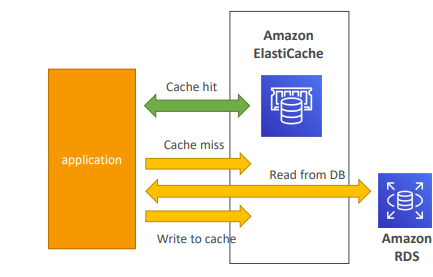

#### RDS, Aurora & ElastiCache

##### Amazon RDS Overview 
+  RDS stands for Relational Database Service
+  It’s a managed DB service for DB use SQL as a query language. 
+  It allows you to create databases in the cloud that are managed by AWS
    +  Postgres
    +  MySQL
    +  MariaDB
    +  Oracle
    +  Microsoft SQL Server
    +  IBM DB2
    +  Aurora (AWS Proprietary database)

##### Advantage over using RDS versus deploying DB on EC2
+  RDS is a managed service:
+  Automated provisioning, OS patching
+  Continuous backups and restore to specific timestamp (Point in Time Restore)!
+  Monitoring dashboards
+  Read replicas for improved read performance
+  Multi AZ setup for DR (Disaster Recovery)
+  Maintenance windows for upgrades
+  Scaling capability (vertical and horizontal)
+  Storage backed by EBS (gp2 or io1)
+  BUT you can’t SSH into your instances

##### RDS-Storage Auto Scaling
+ Dynamic Scaling: Storage Auto Scaling allows you to increase the storage capacity of your RDS DB instance dynamically, without manual intervention.

+ Automatic Scaling: When RDS detects that you are running out of free database storage, it automatically scales the storage capacity for you.

+ Avoid Manual Scaling: With Storage Auto Scaling, you can avoid the manual effort of monitoring storage usage and scaling your database storage.

+ Configuration: To use Storage Auto Scaling, you need to set a Maximum Storage Threshold, which defines the maximum limit for the DB storage.

+ Automatic Adjustment Conditions: Storage Auto Scaling will automatically modify storage if certain conditions are met, such as when free storage is less than 10% of allocated storage, low storage conditions persist for at least 5 minutes, or 6 hours have passed since the last modification.

+ Use Cases: This feature is particularly useful for applications with unpredictable workloads where storage requirements may fluctuate over time.

+ Compatibility: Storage Auto Scaling is supported across all RDS database engine types, including MySQL, PostgreSQL, MariaDB, Oracle, SQL Server, and Amazon Aurora.

##### RDS Read Replicas for read scalability
+ RDS Read Replicas for read scalability: Read Replicas in Amazon RDS (Relational Database Service) are copies of your primary database instance that allow you to offload read queries from your primary database. By distributing read traffic across multiple replicas, you can improve the read scalability of your application.

+ RDS DB instance: This refers to your primary RDS database instance, which handles both read and write operations.

+ RDS DB instance read replica: These are additional instances created from your primary RDS instance specifically for handling read queries. They replicate data from the primary instance asynchronously.

+ Application writes reads reads reads: This indicates that while the application is performing write operations (such as INSERT, UPDATE, DELETE), it's also performing multiple read operations.

+ ASYNC replication: Replication between the primary RDS instance and its read replicas is asynchronous. This means that changes made on the primary instance are not immediately reflected on the replicas. There might be a slight delay, so the read replicas are eventually consistent with the primary instance.

+ Up to 15 Read Replicas: Amazon RDS allows you to create up to 15 read replicas for a given primary database instance.

+ Within AZ, Cross AZ, or Cross Region: Read replicas can be created within the same Availability Zone (AZ) as the primary instance, in a different AZ within the same region, or even in a different region altogether for disaster recovery or geographical distribution purposes.

+ Replicas can be promoted to their own DB: If needed, a read replica can be promoted to become its own standalone database instance. This can be useful for scenarios such as scaling out or performing maintenance on the primary instance.

+ Applications must update the connection string to leverage read replicas: In order to take advantage of read replicas, the application must be configured to distribute read queries across both the primary instance and its read replicas. This typically involves updating the connection string used by the application to include information about the read replicas.

Overall, utilizing read replicas in Amazon RDS can significantly improve the scalability, availability, and performance of your application's read operations, while also providing options for disaster recovery and maintenance.

 

##### RDS Read Replicas Use Cases:
+ Production database handling normal load: You have a primary database instance in production that is currently managing the regular workload of your application.

+ Running a reporting application for analytics: You have a reporting or analytics application that needs to run complex queries and analytics tasks on the data in your database. These queries might be resource-intensive and could potentially impact the performance of your production application if run directly on the primary database instance.

+ Creating a Read Replica for the new workload: To offload the analytics workload from the primary instance and ensure that it doesn't affect the performance of your production application, you create a Read Replica of the primary database instance.

+ Production application remains unaffected: By directing the analytics workload to the Read Replica, you ensure that your production application continues to operate smoothly without any degradation in performance. The Read Replica handles the analytics queries separately, without impacting the primary instance.

+ Read replicas used for SELECT (read-only) statements: Read replicas are ideal for scenarios where you primarily need to perform read operations (SELECT statements) rather than write operations (INSERT, UPDATE, DELETE). In this use case, the reporting or analytics application likely only needs to read data from the database to generate reports or perform analysis, so utilizing a Read Replica is a suitable choice.

 

##### RDS Read Replicas – Network Cost 
+ Network Cost Between AZs: Amazon Web Services (AWS) charges for data transfer between Availability Zones (AZs) within the same region. Whenever data moves from one AZ to another within the same region, there may be associated network costs.

+ RDS Read Replicas Within the Same Region: When you set up Read Replicas for your RDS instance within the same region, you typically don't incur additional network costs. This is because data replication between the primary instance and its replicas occurs within the same region and often within the same AZ. Since there's no data transfer between different AZs or regions, there's no additional fee for network data transfer.

 

##### RDS Multi AZ (Disaster Recovery)
+ RDS Master DB instance (AZ A): This represents your primary RDS database instance, situated in one Availability Zone (AZ). The primary instance handles both read and write operations from your application.

+ Application writes reads: Your application interacts with the primary RDS instance by performing both write and read operations.

+ SYNC replication: In Multi-AZ configuration, data from the primary RDS instance is synchronously replicated to a standby instance located in a different Availability Zone. This ensures that the data is redundantly stored and readily available in case of any failure.

+ One DNS name – automatic app failover to standby: AWS provides a single endpoint (DNS name) for your RDS database. This endpoint automatically directs your application's traffic to the primary instance. In the event of a failure, AWS will automatically redirect the traffic to the standby instance, ensuring seamless failover without requiring manual intervention from your applications.

+ Increase availability: The primary purpose of Multi-AZ deployment is to enhance the availability and reliability of your database. By maintaining a standby instance in a separate AZ, AWS ensures that your database remains accessible even if there is an outage affecting the primary AZ.

+ Failover in case of loss of AZ, loss of network, instance, or storage failure: Multi-AZ deployment guards against various failure scenarios such as loss of an entire AZ, network failures, instance failures, or storage failures. In any such event, AWS automatically initiates failover to the standby instance to minimize downtime and data loss.

+ No manual intervention in apps: Multi-AZ failover is fully automated by AWS. Your applications don't need to handle failover logic or make any changes to adapt to the failover process. AWS manages the failover seamlessly behind the scenes.

+ Not used for scaling: It's important to note that Multi-AZ deployment is primarily designed for high availability and disaster recovery purposes, rather than for scaling out read operations. For read scalability, you would typically use Read Replicas.

+ Read Replicas for Disaster Recovery: While Multi-AZ provides redundancy at the primary instance level, Read Replicas can also be configured with Multi-AZ for additional redundancy and disaster recovery capabilities at the read replica level.

##### RDS from Single-AZ to Multi-AZ
+ Zero Downtime Operation: There's no need to stop the database during this operation. Users can continue to access the database as usual.

+ Modify Database Configuration: You initiate the process by clicking on the "modify" option for the database within the AWS Management Console or through the AWS CLI/API.

+ Snapshot Creation: Internally, RDS takes a snapshot of the existing database. This snapshot serves as a point-in-time backup of the database's current state.

+ Restoration in a New AZ: A new database instance is created and restored from the snapshot in a different Availability Zone (AZ). Availability Zones are physically separate data centers within a region that are engineered to be isolated from failures in other Availability Zones.

+ Synchronization: Once the new Multi-AZ database instance is up and running, synchronization is established between the original Single-AZ database and the new Multi-AZ database. This ensures that data remains consistent across both instances.

+ Failover Ready: After synchronization is complete and the Multi-AZ instance is fully caught up with the original database, it's ready to take over in case of a failure in the primary AZ. In Multi-AZ configuration, RDS automatically handles failover to the standby instance if the primary instance experiences issues.

+ Automatic Updates: From this point on, RDS manages ongoing updates and backups for both the primary and standby instances, ensuring high availability and durability for your database.

##### RDS Custom:
+ Managed Database with OS and Database Customization: Offers similar managed services for Oracle and Microsoft SQL Server databases but with additional customization options.

+ Full Administrative Access: Users have full administrative access to both the underlying OS and the database, allowing for deeper configuration, tuning, and customization.

+ Configuration and Patch Management: Users can configure settings, install patches, and enable native features directly within the OS and database environment.

+ Access to Underlying EC2 Instance: Users can access the underlying EC2 instance hosting the RDS database using SSH or AWS Systems Manager (SSM) Session Manager, providing direct access for administrative tasks.

+ Deactivation of Automation Mode: Users can deactivate the automation mode provided by RDS to perform their customizations. It's advisable to take a database snapshot before making significant changes to ensure data integrity.

##### RDS Lab
+ Search for Amazon RDS and click on create database
+ Choose a database creation method: Standard create
+ Engine option : MySQL
+ version : MySQL 8..28
+ Template: production
+ Availability and durability: Single DB instance
+ Setting : Db instance identifier : database-1
+ Write password
+ Instance configuration : DB instance class : burstable classes and click on include previous generation classes
+ Storage type: General purpose SSD(gp2)
+ Allocated storage: 10
+ Storage autoscaling: enable
+ Maximum storage threshold: 1000 GiB
+ Connectivity: Don't Connect to an EC2 compute resource
+ public access: yes
+ VPC SG(firewall): create new
+ New VPC SG name: demo-database-mysql
+ Database port: 3306
+ Database authentication options:password authentication
+ Database option : initial database name: mydb and enable backup with backup period and perform other remaining action and create database
+ after that open new tab and search for sql electron click on sqlelectron-one single DB client for any relational DB and click on download GUI
+ click on sqlelctron-1.37.1.dmg and install it
+ we can change some rules we want
+ copy endpoint go to sqlelectron and click on add 
+ name :RDSDemo, database type: MySQL, server adrress: paste endpoint detail, user:admin, password : xxxxx, initial database/keysource:mydb and save this then click on connect
+ write: CREATE TABLE table_name (name varchar(20), first_name varchar(20));   
    Result : new table is created
+ Similarly we can have some insert data to insert.    
+ we can create read replica create snapshot in the databse back to the tab
+ make sure to delete database if not in use for that click to modify, we find delete protection disable that and continue and click on apply immediately and modify db instance then we can delete from action

##### Amazon Aurora
+ Aurora is a proprietary technology from AWS (not open sourced)
+ Postgres and MySQL are both supported as Aurora DB (that means your 
drivers will work as if Aurora was a Postgres or MySQL database)
+ Aurora is “AWS cloud optimized” and claims 5x performance improvement 
over MySQL on RDS, over 3x the performance of Postgres on RDS
+ Aurora storage automatically grows in increments of 10GB, up to 128 TB. 
+ Aurora can have up to 15 replicas and the replication process is faster than 
MySQL (sub 10 ms replica lag)
+ Failover in Aurora is instantaneous. It’s HA (High Availability) native. 
+ Aurora costs more than RDS (20% more) – but is more efficient

##### Aurora High Availability and Read Scaling
+ 6 copies of your data across 3 AZ:
    + 4 copies out of 6 needed for writes
    + 3 copies out of 6 need for reads
    + Self healing with peer-to-peer replication
    + Storage is striped across 100s of volumes
+ One Aurora Instance takes writes (master)
+ Automated failover for master in less than 
30 seconds
+ Master + up to 15 Aurora Read Replicas 
serve reads
+ Support for Cross Region Replication

##### Features of Aurora
+ Automatic fail-over
+ Backup and Recovery
+ Isolation and security
+ Industry compliance
+ Push-button scaling
+ Automated Patching with Zero Downtime
+ Advanced Monitoring
+ Routine Maintenance
+ Backtrack: restore data at any point of time without using backups

##### Lab
+ create database using aurora by clicking standard create and MySQL from engine
+ In the bottom, available version: Aurora MySQL(some version or default)
+ template: production
+ DB cluster identifier: database-2
+ master username: admin, and password
+ configuration storage configuration: configuration option:AUrora standard
+ We can edit instance configuration
+ we can also create aurora replica from availability and durability
+ compute resource: Don't connect to EC2 compute resource and network type: IPv4
+ create new security group and name is :demo-database-aurora
+ we have several option to change we can change them according to the need and create database.
+ The database created has role like regional cluster, write and read instance
+ we have now reader and writer instance endpoints
+ we can add more reader from action and create cross region read replica
+ we can create add replica auto scaling from action
+ policy name: ReadReplicaScalingPolicy, we can add cluster capacity detail
+ we can modify and delete aurora database

##### Aurora - Custom Endpoints

##### Aurora Serverless
+ Aurora Serverless: This is a mode of Aurora where the database can automatically start up, shut down, and scale its compute capacity based on the application's needs. Unlike traditional Aurora, which requires you to provision and manage instances, Aurora Serverless handles the scaling and capacity management for you.

+ Shared storage Volume: In Aurora Serverless, the storage layer is shared across multiple instances. This allows for better resource utilization and scalability without sacrificing performance.

+ Proxy Fleet (managed by Aurora): Aurora Serverless uses a proxy fleet to manage connections to the database instances. The proxy fleet handles the connection pooling and routing of requests to the appropriate instances, providing a seamless experience for clients.

+ Automated database instantiation and auto-scaling based on actual usage: Aurora Serverless automatically creates and scales database instances based on the workload demands. It can scale up or down in response to changes in traffic, ensuring that you only pay for the resources you actually use.

+ Good for infrequent, intermittent, or unpredictable workloads: Aurora Serverless is well-suited for workloads that have variable demand patterns, as it can dynamically adjust its capacity to match the workload without manual intervention.

+ No capacity planning needed: With Aurora Serverless, you don't need to perform capacity planning or provisioning of instances. The service handles the infrastructure management, allowing you to focus on your application logic.

+ Pay per second, can be more cost-effective: Aurora Serverless charges you based on the resources consumed by your database, typically on a per-second basis. This can be more cost-effective compared to traditional provisioning models, especially for workloads with unpredictable usage patterns.

##### Global Aurora
+ Aurora Cross Region Read Replicas:
    + Useful for disaster recovery: Cross-region read replicas provide redundancy and can serve as a backup in case of a disaster or outage in the primary region.
    + Simple to put in place: Setting up cross-region read replicas is straightforward and can be easily configured through the AWS Management Console or APIs.
+ Aurora Global Database:
    + Primary Region (read/write): There's one primary region where read and write operations are performed.
    + Secondary Regions (read-only): Up to five secondary regions can be configured, where data is replicated asynchronously from the primary region. Replication lag is typically less than 1 second.
    + Read Replicas per Secondary Region: Each secondary region can have up to 16 read replicas, allowing for scalable read capacity across multiple regions.
    + Decreases latency: By placing read replicas closer to the end-users in different geographic regions, Aurora global databases help reduce latency for read-heavy workloads.
    + Promotion for Disaster Recovery: In the event of a disaster or primary region failure, promoting a secondary region to become the new primary region typically has a Recovery Time Objective (RTO) of less than 1 minute.
    + Cross-region replication latency: Typical cross-region replication latency is less than 1 second, ensuring data consistency across regions.

##### Aurora Machine Learning
+ Aurora Machine Learning integrates ML predictions into applications using SQL queries.
+ Simplifies ML integration without requiring extensive ML expertise.
+ Optimized and secure integration with AWS ML services like SageMaker and Comprehend.
+ Supported use cases include fraud detection, ads targeting, sentiment analysis, and product recommendations.
+ Developers can leverage familiar SQL queries for seamless integration.
+ No prior ML experience necessary for implementation.

##### RDS Backups

+ Automated Backups:

    + Daily full backup of the database during the designated backup window.
    + Transaction logs are backed up every 5 minutes by RDS.
    + Enables point-in-time recovery from the oldest backup to 5 minutes ago.
    + Retention period ranges from 1 to 35 days, with the option to set 0 to disable automated backups.

+ Manual DB Snapshots:

    + Users can manually trigger snapshots as needed.
    + Backups can be retained for any desired duration, allowing flexibility in backup management.

+ Consideration for Stopped RDS Instances:

    + Storage costs still apply to stopped RDS instances.
    + For extended periods of inactivity, it's recommended to take a snapshot and restore when required to avoid ongoing storage expenses.

##### Aurora Backups
+ Automated Backups:

    + Aurora automatically creates backups with a retention period of 1 to 35 days.
    + Point-in-time recovery is supported within this timeframe.

+ Manual DB Snapshots:

    + Users can manually trigger snapshots according to their needs.
    + Backup retention for manual snapshots can be set for any desired duration, offering flexibility in backup management.    

##### RDS & Aurora Restore options
+ Restoring a RDS / Aurora backup or a snapshot creates a new database
+ Restoring MySQL RDS database from S3
+ Create a backup of your on-premises database
+ Store it on Amazon S3 (object storage)
+ Restore the backup file onto a new RDS instance running MySQL
+ Restoring MySQL Aurora cluster from S3
+ Create a backup of your on-premises database using Percona XtraBackup
+ Store the backup file on Amazon S3
+ Restore the backup file onto a new Aurora cluster running MySQL
    
##### Aurora Database Cloning
+ Aurora Database Cloning creates a new DB Cluster from an existing one quickly.
+ It's faster than traditional snapshot and restore methods.
+ The process utilizes a copy-on-write protocol.
+ Initially, the new cluster shares the same data volume as the original, avoiding immediate data copying.
+ Updates to the new cluster trigger additional storage allocation and data copying as needed.
+ This method is very fast and cost-effective.
+ It's ideal for creating staging databases from production databases without affecting production operations.

##### RDS and Aurora Security
+ At-rest encryption:

    + Use AWS KMS to encrypt master and replicas.
    + Master encryption required for replica encryption.
    + Encrypt unencrypted DBs via snapshot restore.

+ In-flight encryption:

    + Default TLS encryption.
    + Utilize AWS TLS root certs client-side.

+ IAM Authentication:

    + Connect using IAM roles, not username/password.
    
+ Security Groups:

    + Control network access to RDS/Aurora DBs.

+ SSH:

    + Not available except on RDS Custom.

+ Audit Logs:

    + Enable and send to CloudWatch Logs for longer retention.

##### Amazon RDS Proxy:
+ Fully managed database proxy service for Amazon RDS.
+ Facilitates pooling and sharing of DB connections established with the database, enhancing efficiency.
+ Reduces stress on database resources like CPU and RAM and minimizes open connections and timeouts.
+ Operates in a serverless manner, automatically scaling, and is highly available across multiple Availability Zones (multi-AZ).
+ Reduces RDS and Aurora failover time by up to 66%.
+ Supports RDS databases including MySQL, PostgreSQL, MariaDB, MS SQL + Server, and Aurora databases for MySQL and PostgreSQL.
+ Typically requires no code changes for most applications.
+ Enforces IAM Authentication for database access and securely stores credentials in AWS Secrets Manager.
+ RDS Proxy is only accessible within the Virtual Private Cloud (VPC) and is not publicly accessible.

##### Amazon ElastiCache Overview
+ Amazon ElastiCache Overview:
    + ElastiCache is a managed caching service on AWS, analogous to RDS for relational databases.
    + It provides managed Redis or Memcached, both being in-memory databases known for high performance and low latency.
    + Helps alleviate the load on primary databases, particularly beneficial for read-intensive workloads.
    + Facilitates making applications stateless by offloading session data and frequently accessed data to the cache.
    + AWS manages OS maintenance, patching, optimizations, setup, configuration, monitoring, failure recovery, and backups.
    + Using ElastiCache typically requires significant application code changes to implement caching logic and integrate with the cache.

##### ElastiCache Solution Architecture -DB Cache
+ Workflow:

    + Applications first query ElastiCache for data.
    + If the data is not available in ElastiCache, the application retrieves it from the RDS database and then stores it in ElastiCache for future use.

+ Purpose:

    + This setup helps to relieve the load on the RDS database by serving frequently accessed data from the cache, reducing the number of direct queries to the database.

+ Invalidation Strategy:

    + An invalidation strategy is crucial to ensure that only the most current and up-to-date data is stored in the cache.
    + This involves mechanisms to expire or invalidate cached data when it becomes outdated or when changes occur in the underlying database.
    + Common strategies include using time-to-live (TTL) settings for cache entries, cache invalidation events triggered by database updates, or a combination of both.
    + By maintaining only relevant and current data in the cache, the system ensures data consistency and avoids serving stale information to the application.    

##### ElastiCache Solution Architecture – User Session Store
+ User logs into any of the 
application
+ The application writes 
the session data into 
ElastiCache
+ The user hits another 
instance of our 
application
+ The instance retrieves the 
data and the user is 
already logged in

##### Elasticache - Redis vs Memcached
+ REDIS:

    + Multi-AZ with Auto-Failover: Supports high availability across multiple Availability Zones with automatic failover.
    + Read Replicas: Allows scaling of reads and ensures high availability.
    + Data Durability: Achieved through Append-Only File (AOF) persistence mechanism.
    + Backup and Restore: Features are available for data backup and restoration.
    + Supports Sets and Sorted Sets: Data structures include sets and sorted sets, allowing for more complex data operations.

+ MEMCACHED:

    + Multi-node for Partitioning: Supports partitioning of data across multiple nodes for scalability (sharding).
    + No High Availability (Replication): Doesn't inherently support high availability through replication.
    + Non-persistent: Data is not inherently persisted to disk.
    + No Backup and Restore: Lacks built-in features for data backup and restoration.
    + Multi-threaded Architecture: Utilizes a multi-threaded architecture for handling concurrent requests efficiently.

